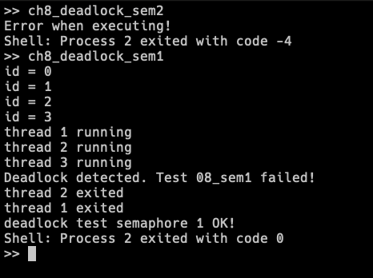

# rCore-Tutorial-Code

## related

- [uCore基本执行环境](https://0x822a5b87.github.io/2025/11/12/ucore%E5%9F%BA%E6%9C%AC%E6%89%A7%E8%A1%8C%E7%8E%AF%E5%A2%83/)
- [uCore批处理系统](https://0x822a5b87.github.io/2025/11/13/ucore%E6%89%B9%E5%A4%84%E7%90%86%E7%B3%BB%E7%BB%9F/)
- [uCore分时任务](https://0x822a5b87.github.io/2025/11/18/ucore%E5%88%86%E6%97%B6%E4%BB%BB%E5%8A%A1/)
- [uCore地址空间](https://0x822a5b87.github.io/2025/11/21/ucore%E5%9C%B0%E5%9D%80%E7%A9%BA%E9%97%B4/)
- [uCore进程及进程管理](https://0x822a5b87.github.io/2025/12/02/ucore%E8%BF%9B%E7%A8%8B%E5%8F%8A%E8%BF%9B%E7%A8%8B%E7%AE%A1%E7%90%86/)
- [uCore文件系统](https://0x822a5b87.github.io/2025/12/09/uCore%E6%96%87%E4%BB%B6%E7%B3%BB%E7%BB%9F/)
- [uCore进程间通信](https://0x822a5b87.github.io/2025/12/13/uCore%E8%BF%9B%E7%A8%8B%E9%97%B4%E9%80%9A%E4%BF%A1/)

## 执行

```bash
cd os
make run

# execute command in bash.
ch8_deadlock_sem2

ch8_deadlock_sem1
```



## Code

- [Soure Code of labs](https://github.com/LearningOS/rCore-Tutorial-Code)

## Documents

- Concise Manual: [rCore-Tutorial-Guide](https://LearningOS.github.io/rCore-Tutorial-Guide/)

- Detail Book [rCore-Tutorial-Book-v3](https://rcore-os.github.io/rCore-Tutorial-Book-v3/)
